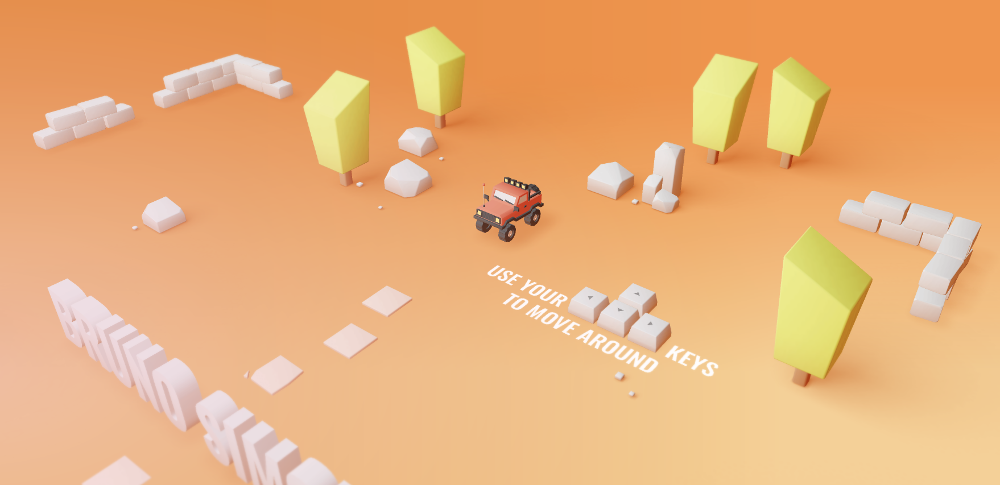

# Threeveloper

## 6. Improving the Project Structure



Hey everyone! 👋

This branch contains the code of [video #6](https://youtu.be/Qa7MSugj8Gw) of this course where we are converting [Bruno Simon's portfolio project](https://bruno-simon.com/) from three.js to react three fiber.

You can use this project as a reference if you get stuck somewhere or if you want to check which exact dependency versions are being used in the videos.

Bruno Simon's portfolio might be updated over time as well, so feel free to download the version downloaded in the video by copying the `src/folio` folder. Please note that the files inside of that folder might be edited slightly in the videos to keep things working. The unedited version can be found [here](https://github.com/sjoerdvanBommel/threeveloper/tree/011-bruno-simon-portfolio-introduction/src/folio).

If you're not familiar with three.js yet, definitely check out [my other videos](https://www.youtube.com/channel/UC74yl2lsr6zF9RENwXrEkpw/) and Bruno Simon's [three.js journey](https://threejs-journey.com/) course.

The source code for each course video is seperated into it's own branch. The link to the branch is added to the description of that video.

👩‍💻 Enjoy coding! 👨‍💻

<br/><br/>

## Getting Started

Once you downloaded the project, you only have to run two commands:

```
npm run install
```

```
npm run dev
```
